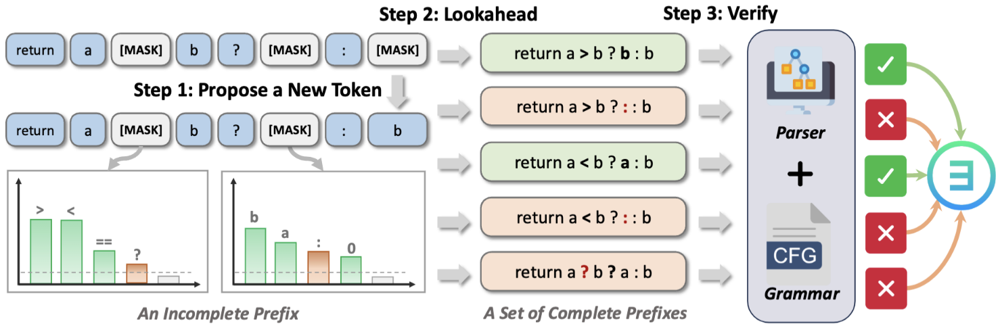

# LAVE

Implementation of **Lookahead-then-Verify: Reliable Constrained Decoding for Diffusion LLMs under Context-Free Grammars**.

> **What this repo gives you**: a *reliable* CFG-constrained decoding algorithm tailored for **diffusion LLMs (dLLMs)**, plus evaluation code on **C++ / JSON / SMILES** structured generation tasks.



---

## ✨ Highlights

- **Reliable constraints for dLLMs**: ensures every intermediate output remains *extendable* under the target CFG (no “dead-end” intermediate states).
- **Lookahead-then-Verify**: uses dLLMs’ parallel token distributions to sample a few “complete prefixes”, then verifies extendability with a grammar parser.
- **Cache-Enhanced Recovery**: a lightweight recovery mechanism to escape difficult decoding contexts without sacrificing reliability.
- **Negligible overhead in practice**: designed to keep verification costs small.

---

## 🔎 Overview (Why LAVE?)

Diffusion LLMs generate tokens **non-autoregressively**, so intermediate outputs often contain placeholder (e.g., `[MASK]`). Classic CFG-constrained decoding assumes *complete prefixes*, which breaks in the diffusion setting.

**LAVE** solves this by:

1. **Propose**: let the dLLM propose a token at some masked position.
2. **Lookahead**: sample tokens for the remaining masked positions inside the current (incomplete) prefix using the model’s *parallel* distributions.
3. **Verify**: run a CFG parser on the sampled *complete* prefixes; accept the proposal if *any* sampled completion is extendable.

This implements the paper’s notion of **reliable constraint**:

> At every decoding step, the current intermediate output remains extendable — i.e., it can still be completed into at least one valid sentence in the target language.

---

## 📦 Installation

### Prerequisites
- Python 3.11+
- Rust (for building the formal language library)
- CUDA-compatible GPU (recommended for inference)

### Setup

We recommend using a virtual environment.

0. **Set up virtual environment**
```bash
cd constrained-diffusion
python3 -m venv venv
source venv/bin/activate
````

1. **Build & install Rust bindings**

```bash
cd rustformlang_bindings
pip install maturin
maturin build --release
pip install .
cd ..
```

2. **Install the main package**

```bash
pip install -e .
```

---

## 🧪 Benchmarks & Tasks

We evaluate CFG-constrained decoding on three representative structured-generation tasks:

| Task   | Benchmark                            | What it tests                                            |
| ------ | ------------------------------------ | -------------------------------------------------------- |
| C++    | HumanEval-CPP (CPP-Bench)            | CFG-compliant **code generation**                        |
| JSON   | JSON-Mode-Eval-Extended (JSON-Bench) | CFG derived from **JSON Schema**, information extraction |
| SMILES | SMILES-Eval (SMILES-Bench)           | CFG-compliant **chemical string** generation             |

Download sources (paper uses these benchmarks):

* HumanEval-X (C++): `https://huggingface.co/datasets/zai-org/humaneval-x`
* JSON-Mode-Eval-Extended: `https://huggingface.co/datasets/eth-sri/json-mode-eval-extended`
* SMILES-Eval: `https://huggingface.co/datasets/eth-sri/smiles-eval`

---

## 🚀 Quickstart

### 1) Run inference

```bash
python eval/dllm/run_dllm.py
```

### 2) Run evaluation

Evaluation is decoupled from inference. Assuming inference outputs are in `results/`:

> For SMILES evaluation, install extra deps:

```bash
pip install rdkit partialsmiles
```

Then run:

```bash
bash eval/check_all_individually.sh results/*
```

---

## ⚙️ Reproducing Paper Settings

**Models evaluated in the paper**

* LLaDA-8B-Instruct
* LLaDA-1.5
* Dream-v0-Instruct-7B
* DiffuCoder-7B-cpGRPO

**Experiment hyperparameters**

- Max generation length `L = 256`
- Denoising steps `T = 128`
- Temperature `= 0.2`
- Semi-autoregressive block size `= 32`
- LAVE: `N = 10`, `τ = 5`

**Metrics**

* `syntactic@k`: at least one of k samples is CFG-valid
* `functional@k`: at least one of k samples is functionally correct